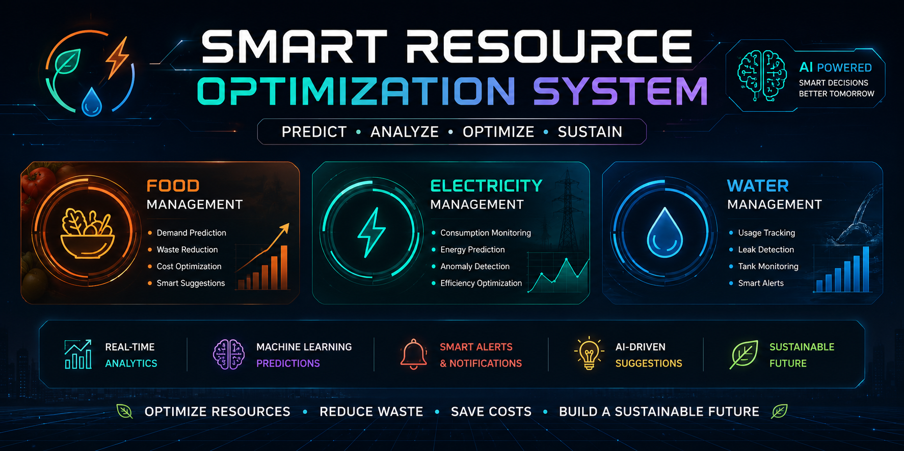
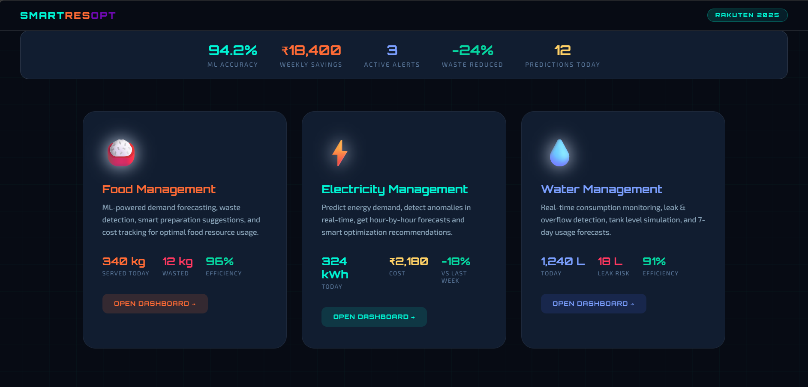
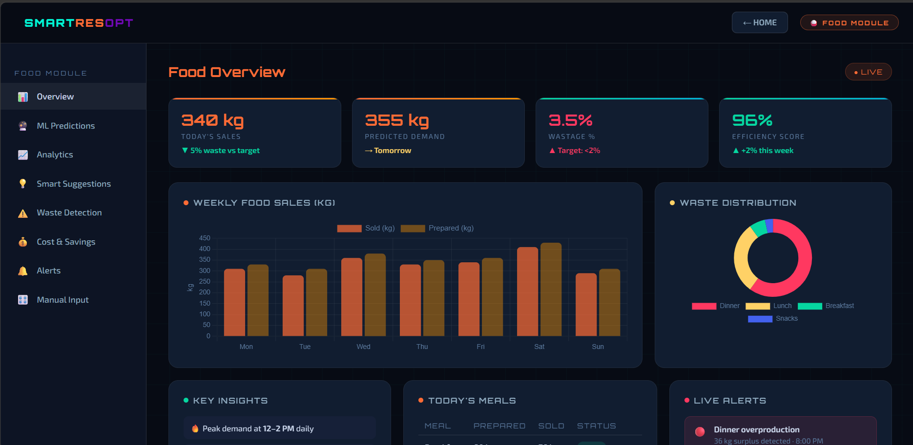
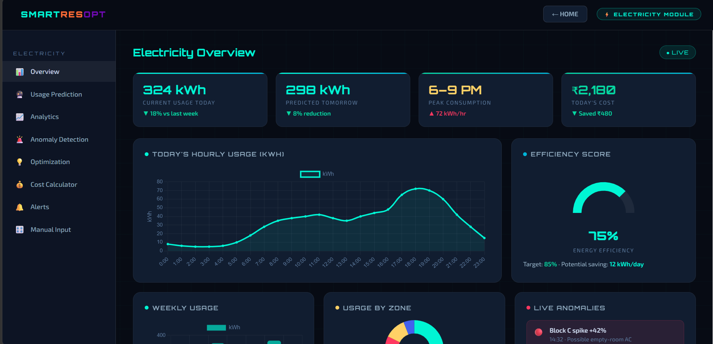
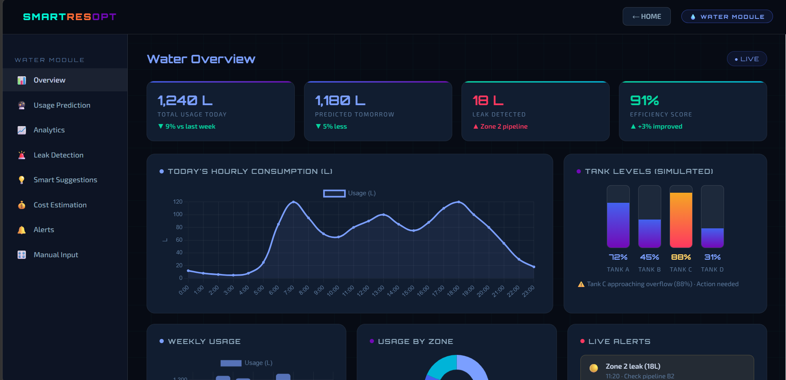

# 🌍 Smart Resource Optimization System

<p align="center">
  
</p>

<p align="center">


</p>

---

# 📖 Overview

The **Smart Resource Optimization System** is an AI-inspired web dashboard that helps organizations monitor, analyze, predict, and optimize the utilization of **Food, Electricity, and Water** resources.

The project demonstrates how modern dashboards, analytics, and Machine Learning concepts can help reduce operational costs, improve efficiency, minimize waste, and support sustainable resource management.

Designed with a futuristic UI, the system provides interactive dashboards, real-time KPIs, smart recommendations, and predictive analytics for better decision-making.

---

# 🚀 Features

## 🍚 Food Management

- Demand Forecasting
- Waste Detection
- Food Preparation Optimization
- Sales Analytics
- Smart Suggestions
- Cost & Savings Tracker
- Live Alerts
- Manual Prediction Simulation

---

## ⚡ Electricity Management

- Energy Consumption Monitoring
- Hourly Usage Prediction
- Cost Estimation
- Peak Usage Detection
- Energy Efficiency Analysis
- Anomaly Detection
- AI Optimization Suggestions
- Smart Alerts

---

## 💧 Water Management

- Water Consumption Monitoring
- Tank Level Monitoring
- Leak Detection
- Water Usage Prediction
- Weekly Analytics
- Smart Suggestions
- Cost Estimation
- Live Alerts

---

# 🎯 Project Objectives

- Reduce Food Waste
- Optimize Electricity Consumption
- Monitor Water Usage
- Improve Operational Efficiency
- Predict Future Resource Demand
- Detect Resource Anomalies
- Reduce Operational Costs
- Support Sustainable Resource Management

---

# 💻 Technologies Used

| Technology | Purpose |
|------------|---------|
| HTML5 | Structure |
| CSS3 | Styling |
| JavaScript | Functionality |
| Chart.js | Interactive Charts |
| Google Fonts | Typography |

---

# 📊 Dashboard Modules

## 🏠 Landing Page

- Overview of all three resource management systems
- Live KPI Cards
- Modern Dashboard UI
- Interactive Navigation

---

## 🍚 Food Dashboard

- Food Sales Analytics
- Weekly Sales Comparison
- Waste Distribution
- ML Demand Prediction
- AI Suggestions
- Cost Tracking
- Smart Alerts

---

## ⚡ Electricity Dashboard

- Energy Monitoring
- Hourly Usage Trends
- Weekly Analytics
- Energy Efficiency Gauge
- Zone-wise Consumption
- Cost Calculator
- Live Anomaly Detection

---

## 💧 Water Dashboard

- Water Consumption Analytics
- Tank Monitoring
- Leak Detection
- Usage Prediction
- Zone Analytics
- Weekly Usage
- Smart Alerts

---

# 🤖 AI & Machine Learning Concepts

This project demonstrates the implementation of AI and Machine Learning concepts such as:

- Demand Forecasting
- Trend Analysis
- Pattern Recognition
- Resource Optimization
- Anomaly Detection
- Predictive Analytics
- Smart Decision Support

---

# 📷 Project Preview

## 🏠 Landing Page



---

## 🍚 Food Dashboard



---

## ⚡ Electricity Dashboard



---

## 💧 Water Dashboard



---

# ✨ Key Highlights

- Modern Dark UI
- Responsive Dashboard
- Interactive Charts
- Animated Interface
- Beautiful Data Visualization
- KPI Cards
- Smart Alerts
- AI-based Recommendations
- Resource Optimization
- Professional Dashboard Design

---

# 🌱 Real-World Applications

This project can be adapted for:

- Smart Cities
- Smart Campuses
- Restaurants
- Hotels
- Manufacturing Industries
- Hospitals
- Shopping Malls
- Educational Institutions
- Corporate Offices

---

# 📁 Project Structure

```
Smart-Resource-Optimization-System/
│
├── index.html
├── README.md
├── banner.png
├── dashboard-home.png
├── food-dashboard.png
├── electricity-dashboard.png
├── water-dashboard.png
├── LICENSE
└── .gitignore
```

---

# ▶️ Getting Started

### Clone the repository

```bash
git clone https://github.com/your-username/Smart-Resource-Optimization-System.git
```

### Open the project

Open the project folder and launch:

```
index.html
```

or use **VS Code Live Server**.

---

# 📈 Future Enhancements

- User Authentication
- Database Integration
- Python Machine Learning Models
- Real-time IoT Sensor Integration
- Cloud Deployment
- PDF Report Generation
- Excel Export
- Notification System
- Mobile Responsive Version
- AI Chat Assistant

---

# 👨‍💻 Developer

## Mohammed Yusuf Lahori

**Aspiring Data Analyst | Power BI Developer | SQL Enthusiast | AI & Analytics Learner**

### Connect with Me

- 💼 LinkedIn: *Add your LinkedIn URL*
- 💻 GitHub: *Add your GitHub URL*

---

# ⭐ Support

If you found this project helpful, consider giving it a **⭐ Star** on GitHub.

It motivates me to build more projects and share them with the community.

---

# 📄 License

This project is developed for **educational**, **portfolio**, and **learning** purposes.
